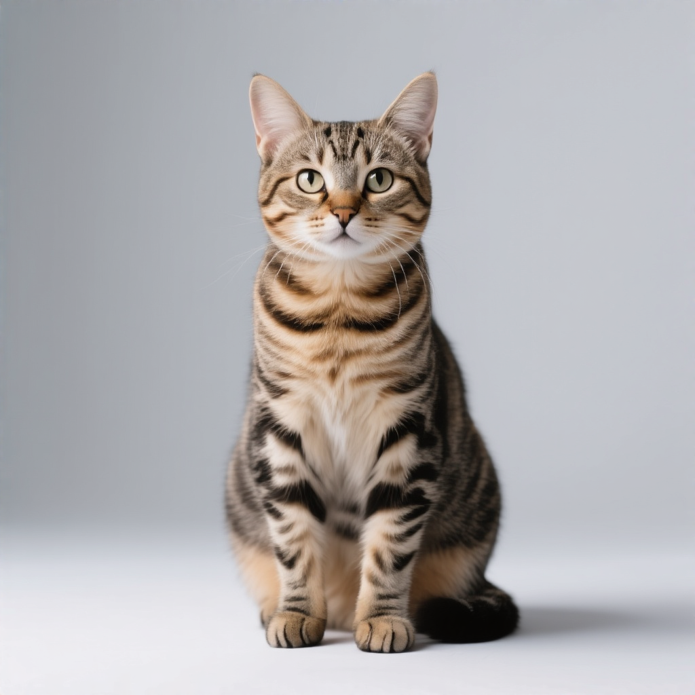
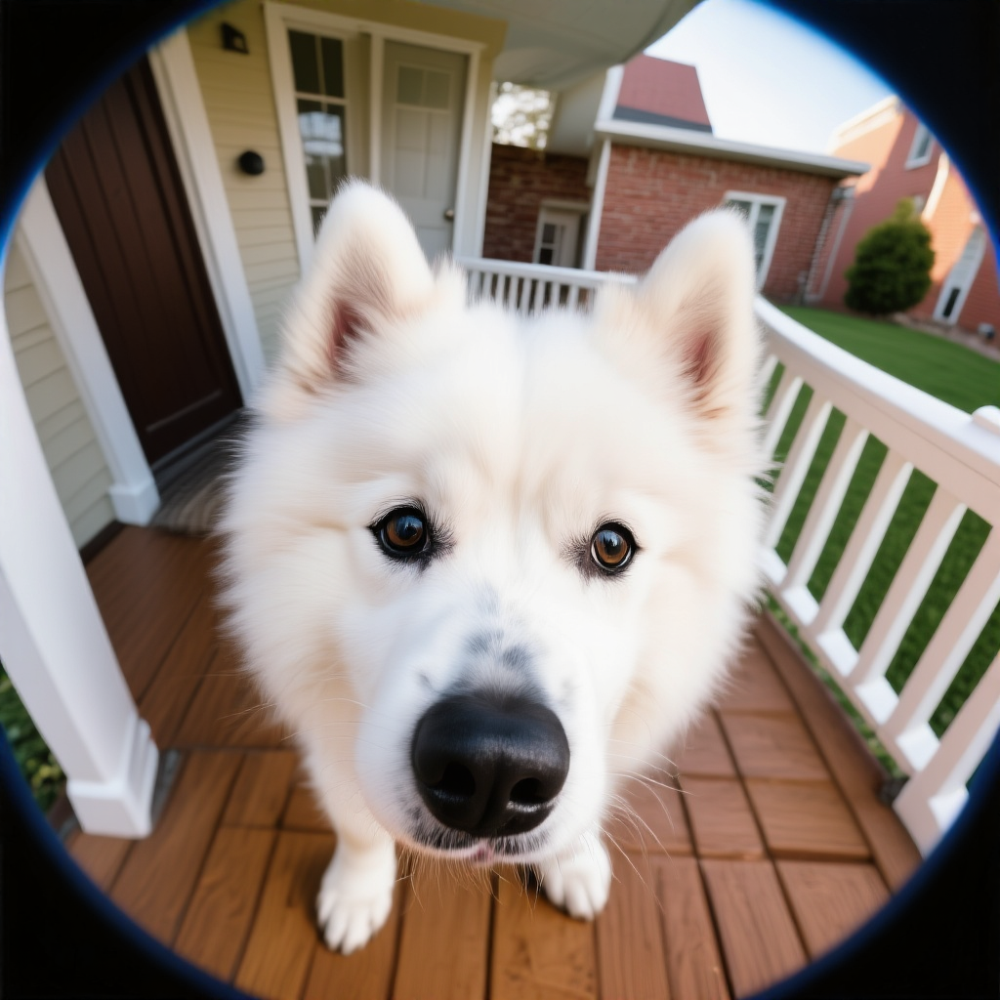
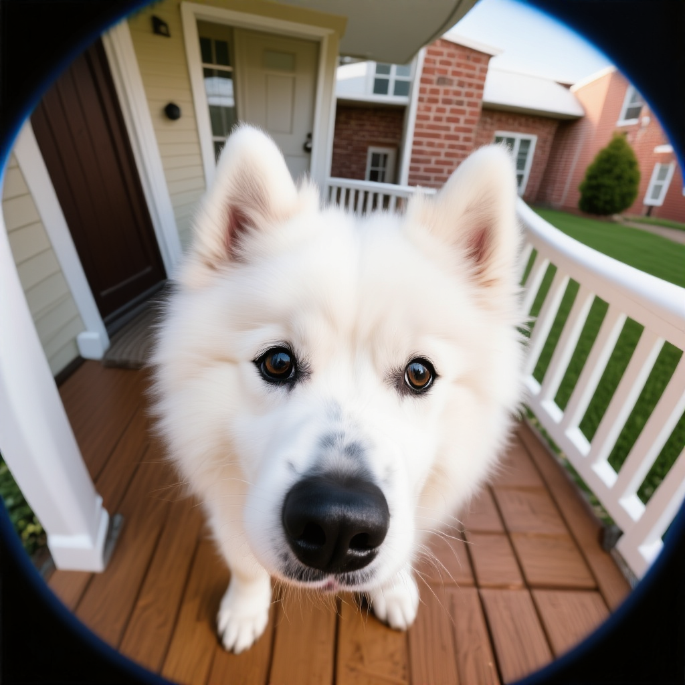

# MammothModa2 attention comparisons

Image pairs for [#7094](https://github.com/vllm-project/vllm-omni/pull/7094), using MammothModa2-Preview at 1024×1024, BF16, 50 steps, CFG 4 and seed 42. Reference uses runtime `050b518`; shared auto uses `4101cf6`. Each pair replays the same AR conditioning and initial noise.

**Studio cat**

| Reference | Shared auto |
| --- | --- |
|  |  |

**Fisheye doorbell Samoyed**

| Reference | Shared auto |
| --- | --- |
|  |  |

[Prompts, captured inputs, original outputs and reproduction scripts](https://github.com/MrlixiangWE/vllm-omni/releases/tag/pr-7094-runtime-050b518-evidence).
